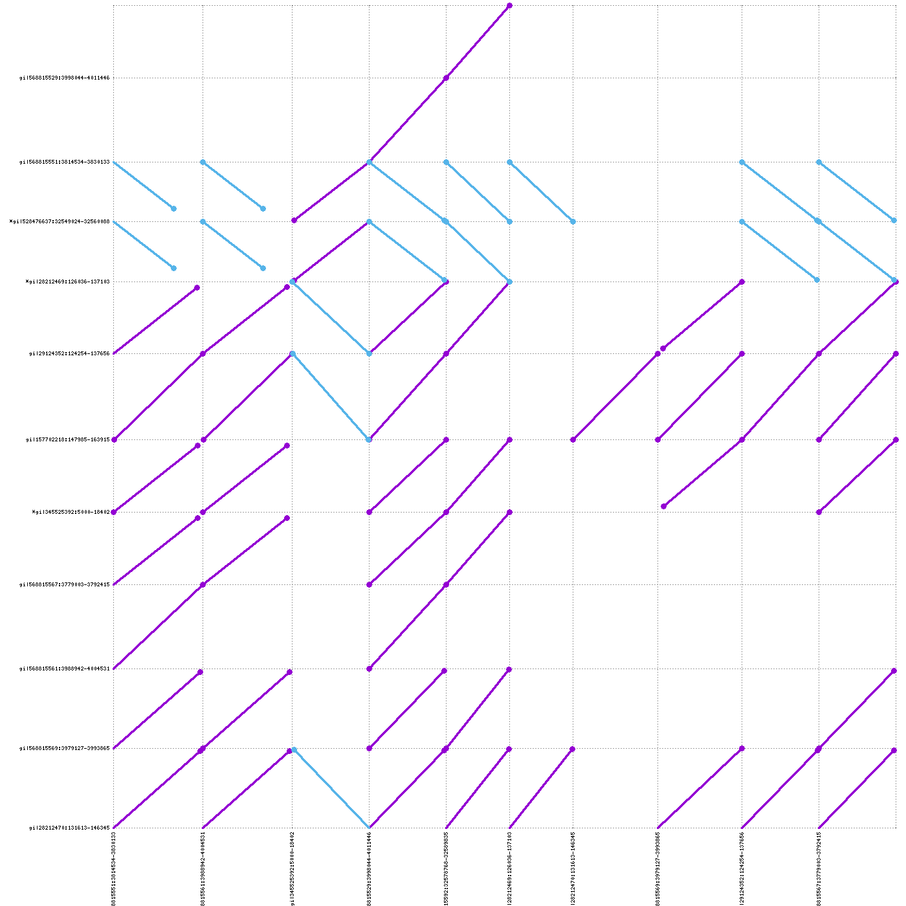
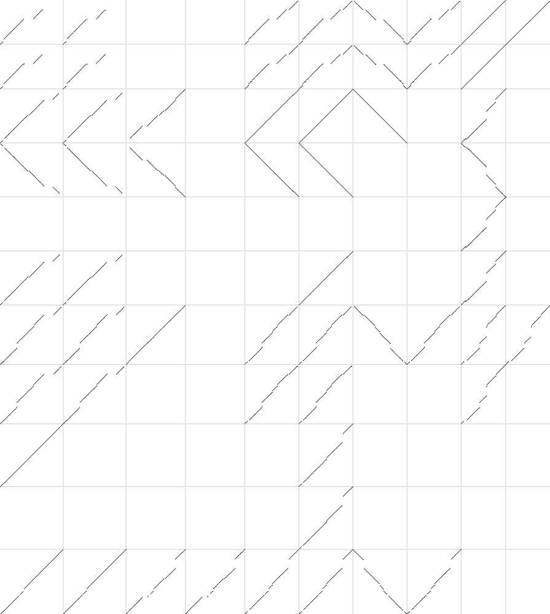

# Reference Graph Pangenome Data Analysis Hackathon 2023

## Small pangenome graph building from sequence alignments

### Learning objectives

- build pangenome graphs using `pggb`
- explore `pggb`'s results
- understand how parameters affect pangenome graph building

### Getting started

Make sure you have `pggb` and its tools installed.
It is already available on the course workstations.
If you want to build everything on your laptop, follow the instructions at the [pggb homepage](https://github.com/pangenome/pggb#installation).
So make sure you have checked out `pggb` repository:

    cd /cbio/projects/031/$USER
	git clone https://github.com/pangenome/pggb.git

Check out also `wfmash` repository (we need one of its scrips):

    cd /cbio/projects/031/$USER
    git clone https://github.com/waveygang/wfmash.git

Now create a directory to work on for this tutorial:

    cd /cbio/projects/031/$USER
	mkdir align_based_pan_graph_building_small
	cd align_based_pan_graph_building_small
	ln -s /cbio/projects/031/$USER/pggb/data

### Building HLA pangenome graphs

The [human leukocyte antigen (HLA)](https://en.wikipedia.org/wiki/Human_leukocyte_antigen) system is a complex of genes on chromosome 6 in humans which encode cell-surface proteins responsible for the regulation of the immune system.

Let's build a pangenome graph from a collection of sequences of the DRB1-3123 gene:

    DIR_BASE=/cbio/projects/031/$USER
    cd $DIR_BASE/align_based_pan_graph_building_small
    pggb -i $DIR_BASE/pggb/data/HLA/DRB1-3123.fa.gz -o $DIR_BASE/align_based_pan_graph_building_small/out_DRB1_3123.1 -n 12

Why did we specify `-n 12`?

  
Click me for the answer

This parameter is important for the graph normalization with `smoothxg`.
It is used to determine the right partial order alignment (POA) problem size for the multiple sequence alignments.

How many pairwise alignments were used to build the graph (take a look at the `PAF` output)? Visualize the alignments:

    DIR_BASE=/cbio/projects/031/$USER
    cd $DIR_BASE/align_based_pan_graph_building_small/out_DRB1_3123.1

    module add gnuplot
    $DIR_BASE/wfmash/scripts/paf2dotplot png large *paf

The last command will generate a `out.png` file with a visualization of the alignments.
Download it to your computer to visualize it:

    USER="PUT HERE YOUR USER NAME ON ILIFU"
    scp $USER@slurm.ilifu.ac.za:/cbio/projects/031/$USER/align_based_pan_graph_building_small/out_DRB1_3123.1/out.png ~/Desktop

Purple lines indicate that the 2 sequences are aligned in the same orientation.
Blue lines indicate that the 2 sequences are aligned in different orientation.

If `paf2dotplot` does not work, you can use [pafplot](https://github.com/ekg/pafplot) to visualize the alignment.
Its outputs are less appealing, but can scale on big alignments.

Take a look at the files in the `out_DRB1_3123.1` folder.

- `*.alignments.wfmash.paf`: sequence alignments;
- `*.log`: whole log;
- `*.params.yml`: `pggb`'s parameters in `YAML` format;
- `*.gfa`: final pangenome graph in GFA format;
- `*.og`: final pangenome graph in ODGI format (used in `odgi`);
- `*.lay`: graph layout in `LAY` format (used in `odgi`);
- `*.lay.tsv`: graph layout in `TSV` format;

Take a look at the images in the same folder:
- `*.draw.png`: static graph layout representation;
  
- `*.draw_multiqc.png`: static graph layout representation with sequences as colored lines;
  

The `*.viz_*.png` images represent the graph in 1 dimension: all nodes are on the horizontal axis, from left to right,
the sequences are represented as colored bars and the graph links are represented as black lines at the bottom of the paths.
Each image follow a different color scheme:
- `*.viz_multiqc.png`: each path has a different color, without any meaning;
  

- `*.viz_depth_multiqc.png`: paths are colored by depth. We define **node depth in a path** as the number of times the node is crossed by a path;
  

- `*.viz_inv_multiqc.png`: paths are colored with respect to the strandness (black for forward, red for reverse);
  

- `.viz_pos_multiqc.png`: paths are colored with respect to the node position in each path. Smooth color gradients highlight well-sorted graphs;
  

- `*.viz_uncalled_multiqc.png`: uncalled bases (`Ns`) are colored in green;
  

- `*.viz_O_multiqc.png`: all paths are compressed into a single line, where we color by path coverage.
  

Try to visualize the graph also with `Bandage`.

Use `odgi stats` to obtain the graph length, and the number of nodes, edges, and paths:

    DIR_BASE=/cbio/projects/031/$USER
    cd $DIR_BASE/align_based_pan_graph_building_small
    odgi stats -i out_DRB1_3123.1/DRB1-3123.fa.gz.bf3285f.eb0f3d3.9c6ea4f.smooth.final.og -S

Do you think the resulting pangenome graph represents the input sequences well?
Check the length and the number of the input sequences to answer this question.
To answer, check the length of the input sequences.

  
Click me for the answer

The input sequences are ~13.6Kbp long, on average.
The graph is about 1.6X longer, so not much longer, then it is a good representation of the input sequences.
Pangenome graphs longer than the input sequences are expected because they contain the input sequences plus their variation.

`pggb`'s default parameters assume an average divergence of approximately 10% (`-p 90` by default).
Try building the same pangenome graph by specifying a higher percent identity

    DIR_BASE=/cbio/projects/031/$USER
    cd $DIR_BASE/align_based_pan_graph_building_small
    pggb -i $DIR_BASE/pggb/data/HLA/DRB1-3123.fa.gz -o $DIR_BASE/align_based_pan_graph_building_small/out_DRB1_3123.2 -n 12 -p 95

Check the graph statistics.
Does this pangenome graph represent better or worse the input sequences than the previously produced graph?

  
Click me for the answer

The graph is much longer than before, about ~4.1X longer than the input sequences.
This indicates a strong under-alignment of all the sequences.
This happens because the HLA locus is highly polymorphic in the population, with great genetic variability.

Try to increase and decrease the segment length (`-s 5000` by default):

    DIR_BASE=/cbio/projects/031/$USER
    cd $DIR_BASE/align_based_pan_graph_building_small
    pggb -i $DIR_BASE/pggb/data/HLA/DRB1-3123.fa.gz -o $DIR_BASE/align_based_pan_graph_building_small/out_DRB1_3123.3 -n 12 -s 15000
    pggb -i $DIR_BASE/pggb/data/HLA/DRB1-3123.fa.gz -o $DIR_BASE/align_based_pan_graph_building_small/out_DRB1_3123.4 -n 12 -s 100

How is this affecting graph statistics?

  
Click me for the answer

This parameter influences the sensitivity in detecting structural variants (SVs) and inversions.
Lower values lead to better resolution of SVs breakpoints and the possibility of detecting shorter inversions,
but at the same time increase the complexity of the graph in terms of the number of nodes and edges.
This happens because short segment lengths lead to catching shorter homologies between the input sequences (that is, more mappings and then alignments).
Higher values reduce sensitivity, but lead to simpler graphs.

Choose another HLA gene from the `data` folder (`A-3105.fa.gz` for example) and explore how the statistics of the resulting graph change as` s` and `p` change.

### Building LPA pangenome graphs

[Lipoprotein(a) (LPA)](https://en.wikipedia.org/wiki/Lipoprotein(a)) is a low-density lipoprotein variant containing a protein called apolipoprotein(a).
Genetic and epidemiological studies have identified lipoprotein(a) as a risk factor for atherosclerosis and related diseases, such as coronary heart disease and stroke.

Try to make LPA pangenome graphs.
The input sequences are in `data/LPA/LPA.fa.gz`.
Sequences in this locus have a peculiarity: which one?
Hint: visualize the alignments and take a look at the graph layout with `Bandage` and/or in the `*.draw_multiqc.png` files.
The `*.draw_multiqc.png` files contain static representations of the graph layout.
They are similar to what `Bandage` shows, probably a little less attractive, but such visualizations can scale to larger pangenomic graphs.
