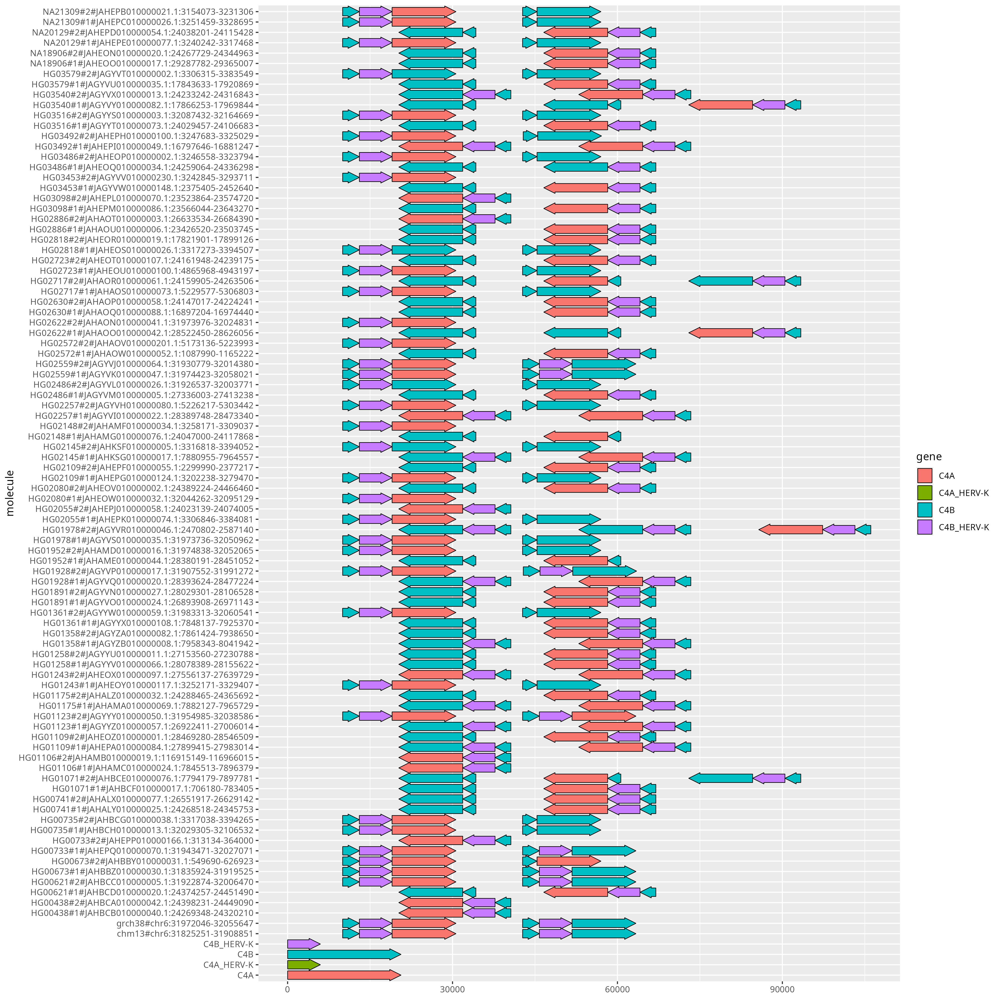
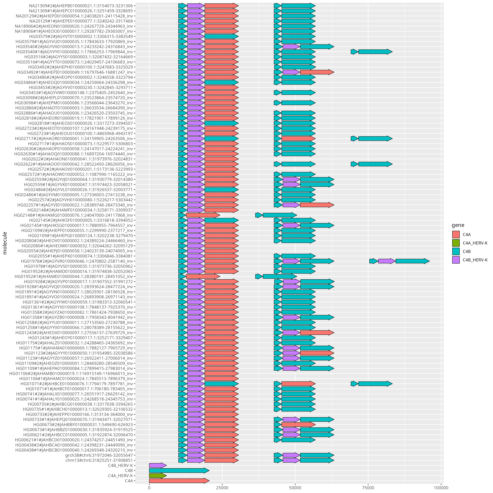

# Reference Graph Pangenome Data Analysis Hackathon 2023

## Understanding pangenome graphs

### Learning objectives

- extract *loci* of interest from the pangenome graph
- untangle the pangenome graph
- visualize pangenome graph annotation

### Getting started

Check out `odgi` repository (we need one of its example):

    cd ~
    git clone https://github.com/pangenome/odgi.git

Now create a directory to work on for this tutorial:

    cd ~
	mkdir understanding_pangenome_graphs
	cd understanding_pangenome_graphs
    ln -s ~/odgi/test

### MHC locus

Download the HPRC pangenome graph of the human chromosome 6 in GFA format, decompress it, and convert it to a graph in `odgi` format.

    wget https://s3-us-west-2.amazonaws.com/human-pangenomics/pangenomes/scratch/2021_11_16_pggb_wgg.88/chroms/chr6.pan.fa.a2fb268.4030258.6a1ecc2.smooth.gfa.gz
    gunzip chr6.pan.fa.a2fb268.4030258.6a1ecc2.smooth.gfa.gz

    odgi build -g chr6.pan.fa.a2fb268.4030258.6a1ecc2.smooth.gfa -o chr6.pan.og -t 16 -P

This graph contains contigs of 88 haploid, phased human genome assemblies from 44 individuals, plus the `chm13` and `grch38` reference genomes.

### Graph extraction

The [major histocompatibility complex (MHC)](https://en.wikipedia.org/wiki/Major_histocompatibility_complex) is a large locus in vertebrate DNA containing a set of closely linked polymorphic genes that code for cell surface proteins essential for the adaptive immune system.
In humans, the MHC region occurs on chromosome 6.
The human MHC is also called the HLA (human leukocyte antigen) complex (often just the HLA).

To see the coordinates of some HLA genes, execute:

    head test/chr6.HLA_genes.bed -n 5

The coordinates are expressed with respect to the `grch38` reference genome.

To extract the subgraph containing all the HLA genes annotated in the `chr6.HLA_genes.bed` file, let's prepare a BED with a single interval containing all those genes:

    bedtools merge -i test/chr6.HLA_genes.bed -d 10000000 > chr6.interval_to_extract.bed

and then we execute:

    odgi extract -i chr6.pan.og -o chr6.pan.MHC.og -b chr6.interval_to_extract.bed -O -t 16 -P

The instruction extracts:

- the nodes belonging to the `grch38#chr6` path ranges specified in the `chr6.HLA_genes.bed` file via `-b`,
- the edges connecting all the extracted nodes, and
- the paths traversing all the extracted nodes.

How many paths are present in the extracted subgraph?
With 90 haplotypes (44 diploid samples plus 2 haploid reference genomes), how many paths would you expect in the subgraph if the MHC locus were solved with a single contig per haplotype?

  
Click me for the answer

We expect 90 paths in the extracted graph, one for each haplotype.

To visualize the graph, execute:

    odgi viz -i chr6.pan.MHC.og -o chr6.pan.MHC.png -s '#'

The `-s '#'` parameter is to color each haplotype (not each contig) with a different color .

Are there haplotypes where the MHC locus is not resolved with a single contig?
If so, which ones? Counts the number of contigs for each haplotype.

Generate the graph layout with `odgi layout`:

    odgi layout -i chr6.pan.MHC.og -o chr6.pan.MHC.lay -t 32 --temp-dir /scratch -P

**IMPORTANT**: The `--temp-dir` parameter is used to specify the directory used for temporary files.
This directory should be on a high-speed disk (like an SSD) to avoid severe slowdowns during the graph layout computation.

Visualize the layout with `odgi draw`:

    odgi draw -i chr6.pan.MHC.og -c chr6.pan.MHC.lay -p chr6.pan.MHC.layout.png

The MHC locus includes the complement component 4 (C4) region, which encodes proteins involved in the complement system.
In humans, the C4 gene exists as 2 functionally distinct genes, C4A and C4B, which both vary in structure and **copy number** ([Sekar et al., 2016](https://doi.org/10.1038/nature16549)).
Moreover, C4A and C4B genes segregate in both long and short genomic forms, distinguished by the **presence or absence** of a human endogenous retroviral (HERV) sequence.

Find C4 coordinates:

    wget http://hgdownload.soe.ucsc.edu/goldenPath/hg38/bigZips/hg38.chrom.sizes
    wget https://hgdownload.soe.ucsc.edu/goldenPath/hg38/bigZips/genes/hg38.ncbiRefSeq.gtf.gz
    zgrep 'gene_id "C4A"\|gene_id "C4B"' hg38.ncbiRefSeq.gtf.gz |
      awk '$1 == "chr6"' | cut -f 1,4,5 |
      bedtools sort | bedtools merge -d 15000 | bedtools slop -l 10000 -r 20000 -g hg38.chrom.sizes |
      sed 's/chr6/grch38#chr6/g' > hg38.ncbiRefSeq.C4.coordinates.bed

Extract the C4 locus:

    odgi extract -i chr6.pan.og -b hg38.ncbiRefSeq.C4.coordinates.bed -o - -O -t 16 -P | odgi sort -i - -o chr6.pan.C4.sorted.og -p Ygs -x 100 -t 16 --temp-dir /scratch -P

`odgi sort -p Ygs` will apply three different graph sorting algorithms, the same that are used in `pggb`.

Regarding the `odgi viz` visualization, select the haplotypes to visualize

    odgi paths -i chr6.pan.C4.sorted.og  -L | grep 'chr6\|HG00438\|HG0107\|HG01952' > chr6.selected_paths.txt

and visualize them

    # odgi viz: default mode
    odgi viz -i chr6.pan.C4.sorted.og -o chr6.pan.C4.sorted.png -p chr6.selected_paths.txt

    # odgi viz: color by strand
    odgi viz -i chr6.pan.C4.sorted.og -o chr6.pan.C4.sorted.z.png -p chr6.selected_paths.txt -z

    # odgi viz: color by position
    odgi viz -i chr6.pan.C4.sorted.og -o chr6.pan.C4.sorted.du.png -p chr6.selected_paths.txt -du

    # odgi viz: color by depth
    odgi viz -i chr6.pan.C4.sorted.og -o chr6.pan.C4.sorted.m.png -p chr6.selected_paths.txt -m -B Spectral:4

For the `chr6.pan.C4.sorted.m.png` image we used the Spectra color palette with 4 levels of node depths, so  white indicates no depth, while grey, red, and yellow indicate depth 1, 2, and greater than or equal to 3, respectively.
What information does this image provide us about the state of the C4 region in the selected haplotypes?

  
Click me for the answer

The two reference genomes have 2 copies of the C4 genes and both of them present the HERV sequence.
HG00348 has 1 copy (HERV sequence included) in both its haplotypes.
HG01071 has the MATERNAL haplotype with 3 copies, with 2 of them without the HERV sequence, and the PATERNAL haplotype with 2 copies of which 1 without the HERV sequence.
HG01952 has the MATERNAL haplotype with 2 copies of which 1 without the HERV sequence, and the PATERNAL haplotype with 2 copies, both of them without the HERV sequence.

Visualize all haplotypes with `odgi viz`, coloring by depth.
How many haplotypes have three copies of the C4 region?
How many haplotypes are missing the HERV sequence?

Use `odgi layout` and `odgi draw` to compute and visualize the layout of the C4 locus.
The HERV sequence may be present or absent in the C4 regions across haplotypes: how does this reflect on the structure of the graph layout?

### Graph untangling

To obtain another view of a collapsed locus, we can apply `odgi untangle` to linearize the relationships between paths.

To untangle the C4 graph, execute:

    (echo query.name query.start query.end ref.name ref.start ref.end score inv self.cov n.th |
      tr ' ' '\t'; odgi untangle -i chr6.pan.C4.sorted.og -r $(odgi paths -i chr6.pan.C4.sorted.og -L | grep grch38) -t 16 -m 256 -P |
      bedtools sort -i - ) | awk '$8 == "-" { x=$6; $6=$5; $5=x; } { print }' |
      tr ' ' '\t'   > chr6.pan.C4.sorted.untangle.bed

Take a look at the `chr6.pan.C4.sorted.untangle.bed` file.
For each segment in the query (`query.name`, `query.start`, and `query.end` columns), the best match on the reference is reported (`ref.name`, `ref.start`, and `ref.end`),
with information about the quality of the match (`score`), the strand (`inv`), the copy number status (`self.cov`), and its rank over all possible matches (`n.th`).

Try to visualize the results with `ggplot2` in R (hint: the intervals in the BED file can be displayed with `geom_segment`).
Compare such a visualization with the visualization obtained with the `odgi viz` coloring by depth.

### Annotation injection

A pangenome graph represents the alignment of many genome sequences.
By embedding gene annotations into the graph as paths, we align them with all other paths.

We start with gene annotations against the GRCh38 reference.
Our annotations are against the full `grch38#chr6`, in `test/chr6.C4.bed`.
Take a look at the first column in the annotation file

    head test/chr6.C4.bed

However, the C4 locus graph `chr6.c4.gfa` is over the reference range, that is `grch38#chr6:31972046-32055647`.
With `odgi paths` we can take a look at the names of the paths in the graph:

    odgi paths -i chr6.pan.C4.sorted.og -L | grep grc

So, we must adjust the annotations to match the subgraph to ensure that path names and coordinates exactly correspond between the BED and GFA.
We do so using `odgi procbed`, which cuts BED records to fit within a given subgraph:

    odgi procbed -i chr6.pan.C4.sorted.og -b test/chr6.C4.bed > chr6.C4.adj.bed

The coordinate space now matches that of the C4 subgraph.
Now, we can inject these annotations into the graph:

    odgi inject -i chr6.pan.C4.sorted.og -b chr6.C4.adj.bed -o chr6.C4.genes.og -P

Use `odgi viz` to visualize the new subgraph with the injected paths.

We now use the gene names and the `gggenes` output format from `odgi untangle` to obtain a gene arrow map. We specify the injected paths as target paths:

    odgi paths -i chr6.C4.genes.og -L | tail -4 > chr6.C4.gene.names.txt

    odgi untangle -R chr6.C4.gene.names.txt -i chr6.C4.genes.og -j 0.5 -g -t 16 -P > chr6.C4.gene.gggenes.tsv

We use `-j 0.5` to filter out low-quality matches.

If you have `R` installed on your local machine, you can plot `odgi untangle` output with `gggenes`:

    require(ggplot2)
    require(gggenes)
    x <- read.delim('/home/guarracino/Desktop/chr6.C4.gene.gggenes.tsv')
    ggplot(x, aes(xmin=start, xmax=end, y=molecule, fill=gene, forward=strand)) + geom_gene_arrow()
    ggsave('c4.gggenes.png', height=14, width=14)

The plot will look a bit odd because some of the paths are in reverse complement orientation relative to the annotations.
We can clean this up by using `odgi flip`, which flips paths around if they tend to be in the reverse complement orientation relative to the graph:

    odgi flip -i chr6.C4.genes.og -o chr6.C4.genes.flip.og -t 16 -P
    
    odgi untangle -i chr6.C4.genes.flip.og -R chr6.C4.gene.names.txt -j 0.5 -t 16 -g -P > chr6.C4.gene.gggenes.tsv

Plot the new results:

What is changed?
