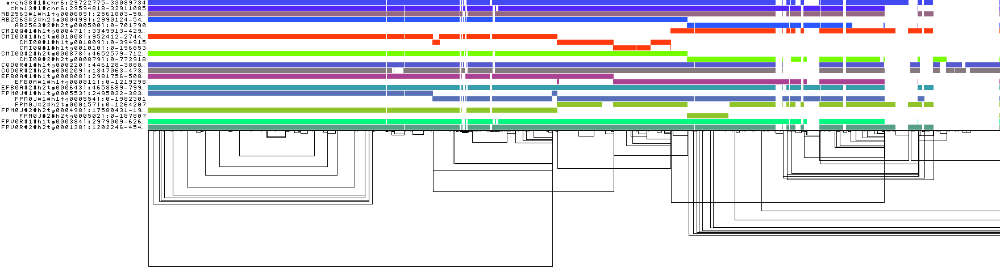
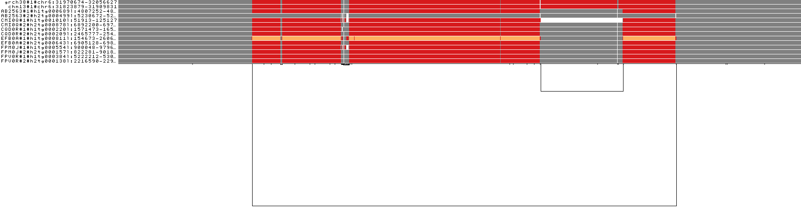
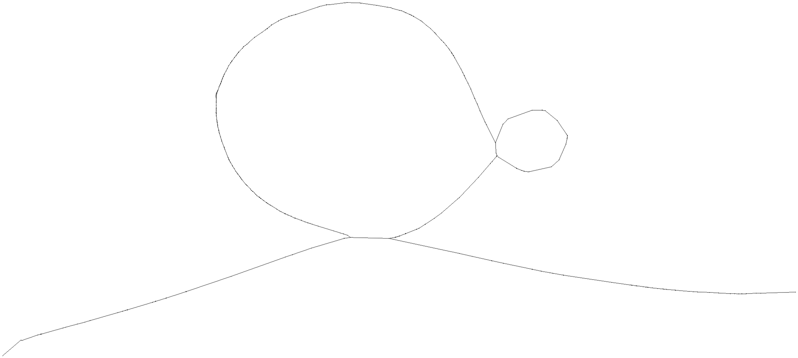
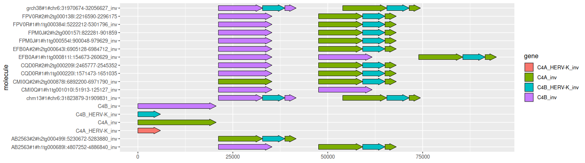
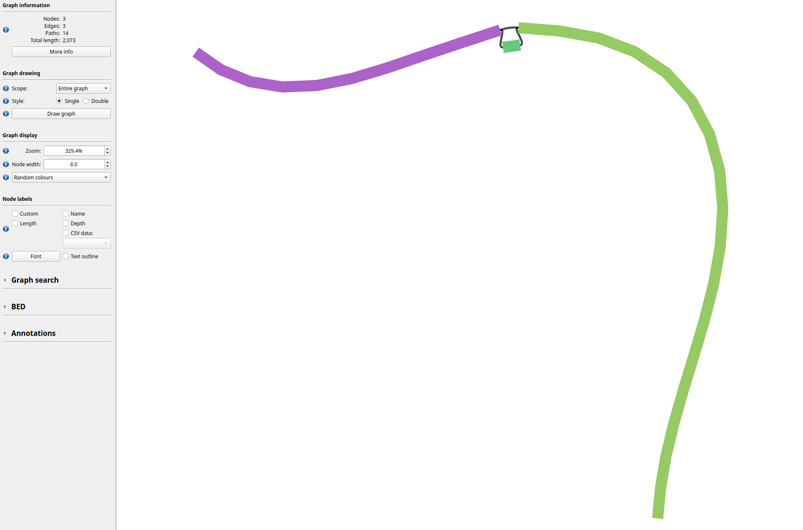

# Reference Graph Pangenome Data Analysis Hackathon 2023

## Understanding H3ABioNet pangenome graphs

You can find the `pggb` graphs for all chromosomes here: `/cbio/projects/031/andreaguarracino/6samples`.
Each graph was made with 6 diploid samples (so 12 haplotypes) plus 2 reference genomes (`GRCh38` and `CHM13`).

### Chromosome 6 pangenome graph

We extract the MHC locus and color bars by haplotype.
 


The MHC locus is a bit broken:
- the worst sample, `CMI0Q`, covers the locus with multiple contigs;
- the best sample, `FPV0R`, covers the locus with 1 contig for each haplotype.

Let's take a look at the C4 locus.
In 1D, we color by copy number:
- white: 0 copies
- grey: 1 copy
- red: 2 copies
- orange: 3 copies



The `EFB0A#1` haplotype has 3 copies of the C4 genes.

The graph layout is the [grafiocavallo](https://en.wikipedia.org/wiki/Caciocavallo) that we expect:



The big loop represents the copy number variation, while the nested loop differentiates the short and long forms of the C4 genes.

If we inject `GRCh38` annotations and untangle the graph, we can see a bit closer the C4 variation:



The locus is inverted in the graph (not a problem).


### Same variant, different representations

The same variant can be expressed differently into a VCF file with respect to the reference sequence to which variation is expressed.

```shell
##fileformat=VCFv4.2
##FORMAT=<ID=GT,Number=1,Type=String,Description="Genotype">
##INFO=<ID=CONFLICT,Number=.,Type=String,Description="Sample names for which there are multiple paths in the graph with conflicting alleles">
##INFO=<ID=AC,Number=A,Type=Integer,Description="Total number of alternate alleles in called genotypes">
##INFO=<ID=AF,Number=A,Type=Float,Description="Estimated allele frequency in the range (0,1]">
##INFO=<ID=NS,Number=1,Type=Integer,Description="Number of samples with data">
##INFO=<ID=AN,Number=1,Type=Integer,Description="Total number of alleles in called genotypes">
##INFO=<ID=LV,Number=1,Type=Integer,Description="Level in the snarl tree (0=top level)">
##INFO=<ID=PS,Number=1,Type=String,Description="ID of variant corresponding to parent snarl">
##INFO=<ID=AT,Number=R,Type=String,Description="Allele Traversal as path in graph">

##contig=<ID=grch38#1#chr20,length=64444167>
#CHROM          POS     ID              REF  ALT  QUAL  FILTER  INFO                                                                      FORMAT  AB2563  CMI0Q  CQD0R  EFB0A  FPM0J  FPV0R  grch38
chm13#1#chr20   553892  <338912<338910  CT   C    60    .       AC=9;AF=0.692308;AN=13;AT=>338910>338911>338912,>338910>338912;NS=7;LV=0  GT      0|1     1|1    0|0    1|1    1|1    1|0    1

##contig=<ID=chm13#1#chr20,length=66210255>
#CHROM          POS     ID              REF  ALT  QUAL  FILTER  INFO                                                                      FORMAT  AB2563  CMI0Q  CQD0R  EFB0A  FPM0J  FPV0R  chm13
grch38#1#chr20  510173  <338912<338910  C    CT   60    .       AC=5;AF=0.384615;AN=13;AT=>338910>338912,>338910>338911>338912;NS=7;LV=0  GT      1|0     0|0    1|1    0|0    0|0    0|1    1
```


