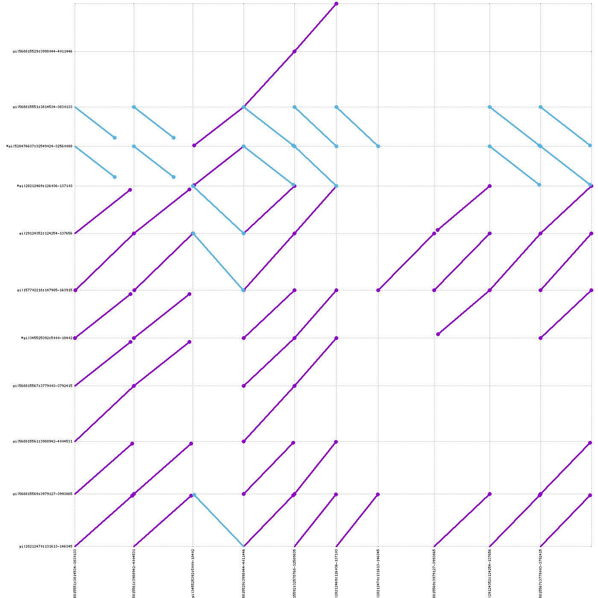
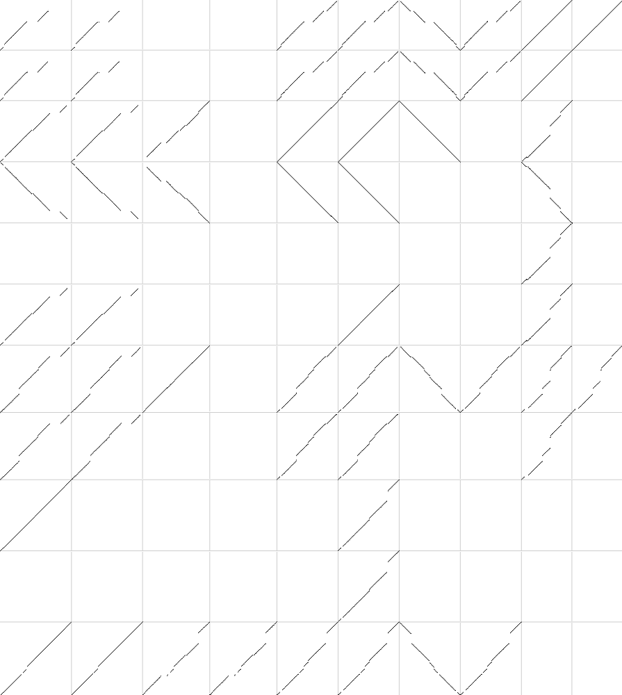
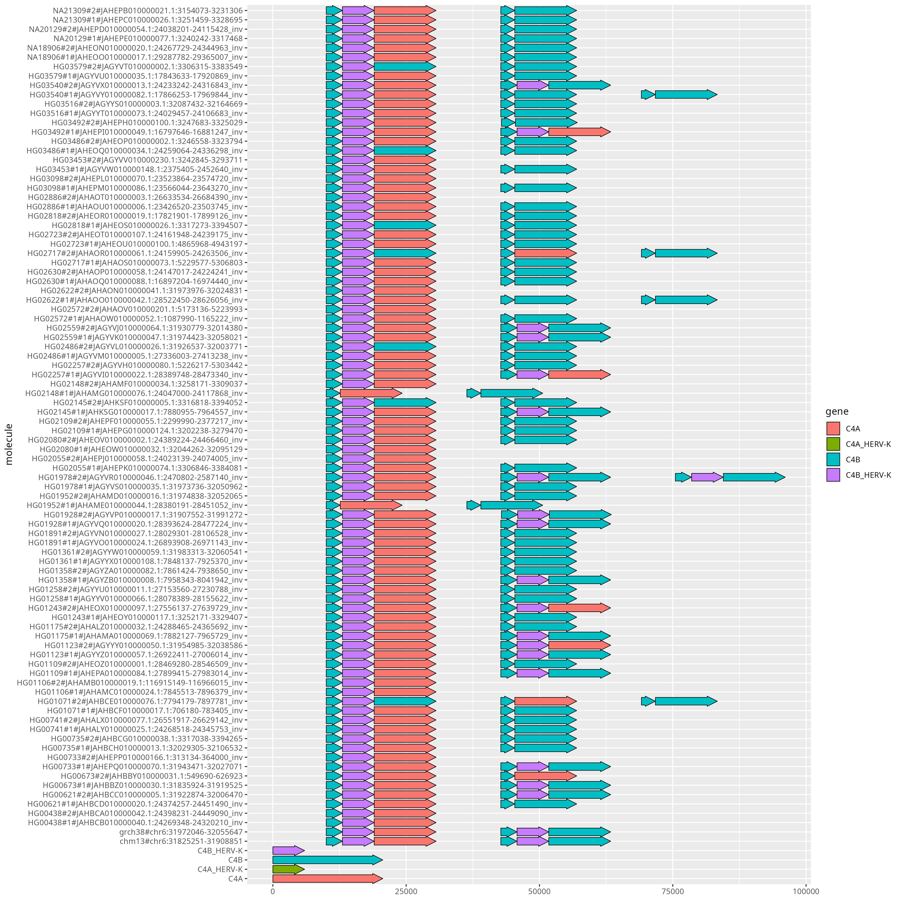

# Reference Graph Pangenome Data Analysis Hackathon 2023

Material for the **Reference Graph Pangenome Data Analysis Hackathon 2023**, November 13-17 in Cape Town, South Africa.
The event was sponsored by [H3ABioNet](https://www.h3abionet.org/).

## Table of Contents

* [Reference-based pangenome graph building](#reference-based-pangenome-graph-building)
  * [Constructing and viewing your first graphs](#constructing-and-viewing-your-first-graphs)
* [Small pangenome graph building from sequence alignments](#small-pangenome-graph-building-from-sequence-alignments)
  * [Building HLA pangenome graphs](#building-hla-pangenome-graphs)
  * [Building LPA pangenome graphs](#building-lpa-pangenome-graphs)
* [Human pangenome graph building from sequence alignments](#human-pangenome-graph-building-from-sequence-alignments)
  * [Pangenome Sequence Naming](#pangenome-sequence-naming)
  * [Sequence partitioning](#sequence-partitioning)
  * [Building chromosome-specific pangenome graphs](#building-chromosome-specific-pangenome-graphs)
* [Understanding pangenome graphs](#understanding-pangenome-graphs)
  * [MHC locus](#mhc-locus)
  * [Graph extraction](#graph-extraction)
  * [Graph untangling](#graph-untangling)
  * [Annotation injection](#annotation-injection)

## Reference-based pangenome graph building

### Learning objectives

- construct graphs using `vg construct`
- visualize graphs using `vg view` and `Bandage`
- convert graphs using `vg view`

### Getting started

Make sure you have `vg` installed.
It is already available on the course workstations.
In this exercise, you will use small toy examples from the `test` directory of `vg`.
So make sure you have checked out `vg` repository:

    cd ~
	git clone https://github.com/vgteam/vg.git

Now create a directory to work on for this tutorial:

    cd ~
	mkdir ref_based_pangenome_graph_building
	cd ref_based_pangenome_graph_building
	ln -s ~/vg/test/tiny

### Constructing and viewing your first graphs

First we will use `vg construct` to build our first graph.
Run it without parameters to get information on its usage:

	vg construct

We will construct a reference-based graph from the sequence in file `tiny/tiny.fa`, which looks like this:

	>x
	CAAATAAGGCTTGGAAATTTTCTGGAGTTCTATTATATTCCAACTCTCTG

To construct a simple graph, run:

	vg construct -r tiny/tiny.fa -m 32 > tiny.ref.vg

This will create a graph that just consists of a linear chain of nodes, each with 32 characters.

The `-m` option tells `vg` to put at most 32 characters into each graph node.

To visualize a graph, you can use `vg view`.
By default, `vg view` will output a graph in [GFA](https://github.com/GFA-spec/GFA-spec/blob/master/GFA1.md) format.

	vg view tiny.ref.vg | column -t
      H  VN:Z:1.1                                          
      S  1         CAAATAAGGCTTGGAAATTTTCTGGAGTTCTA        
      S  2         TTATATTCCAACTCTCTG                      
      P  x         1+,2+                             *
      L  1         +                                 2  +  0M

In GFA format, each line is a separate record of some part of the graph.
The lines come in several types, which are indicated by the first character of the line.
What do you think they indicate?

  
Click me for the answers

In a GFA file there are these following line types:
- `H`: a header.
- `S`: a "sequence" line, which is the sequence and ID of a node in the graph.
- `L`: a "link" line, which is an edge in the graph.
- `P`: a "path" line, which labels a path of interest in the graph. In this case, the path is the walk that the reference sequence takes through the graph.

Of note, the format does not specify that these lines come in a particular order.

Try to run `vf construct` with different values of `-m` and observe the different results.

Now let's build a new graph that has some variants built into it.
First, take a look at `tiny/tiny.vcf.gz`, which contains variants in (gzipped) [VCF](https://samtools.github.io/hts-specs/VCFv4.2.pdf) format.

    zgrep '^##' -v tiny/tiny.vcf.gz | column -t
      #CHROM  POS  ID  REF  ALT  QUAL  FILTER  INFO                           FORMAT  1
      x       9    .   G    A    99    .       AC=1;LEN=1;NA=1;NS=1;TYPE=snp  GT      1|0
      x       10   .   C    T    99    .       AC=2;LEN=1;NA=1;NS=1;TYPE=snp  GT      1|1
      x       14   .   G    A    99    .       AC=1;LEN=1;NA=1;NS=1;TYPE=snp  GT      1|0
      x       34   .   T    A    99    .       AC=2;LEN=1;NA=1;NS=1;TYPE=snp  GT      1|1
      x       39   .   T    A    99    .       AC=1;LEN=1;NA=1;NS=1;TYPE=snp  GT      1|0

then use `vg construct` to build the graph:

	vg construct -r tiny/tiny.fa -v tiny/tiny.vcf.gz -m 32 > tiny.vg

We can write the graph in [GFA](https://github.com/GFA-spec/GFA-spec/blob/master/GFA1.md) format:

    vg view tiny.vg > tiny.gfa

A tool for visualizing (not too big) pangenome graphs is [BandageNG](https://github.com/asl/BandageNG).
It supports graphs in GFA format.
To use Bandage, just download it locally on your computer:

    wget -c https://github.com/asl/BandageNG/releases/download/v2022.09/BandageNG-9eb84c2-x86_64.AppImage
    chmod +x BandageNG-9eb84c2-x86_64.AppImage

Then download the graph on your computer and try to visualize it locally with:

    ./BandageNG-9eb84c2-x86_64.AppImage load tiny.gfa 

Click the `Drawn graph` button to visualize the graph.
Click the `Length Node` button under Node labels feature.
Select the longest node (it is in the middle, 19 bp) by clicking on it, then click the `Paths...` button to see the paths that pass through the selected node.
Check that the paths displayed are the same as you expect by checking the GFA. Any problems?

  
Click me for the answers

The GFA format does not specify that its lines have to follow a particular order.
However, the downloaded version of Bandage seems to have a bug in reading the paths properly.
Edit the GFA file by moving the `P` at the end of the file.
Now `Bandage` should show correctly the paths traversing the selected node.
Never trust the tools!

Try to generate a PNG image with `Bandage` (take a look at the `BandageNG-9eb84c2-x86_64.AppImage -h` output).
This can be helpful to take at graphs that are too big to be directly loaded with `Bandage`.

Now, let's build a new complex graph.
First, take a look at `tiny/multi.vcf.gz`, which contains multiallelic variants. 
Try to generate with that input a graph in GFA format and visualize the output with `Bandage`. What are you able to see?

## Small pangenome graph building from sequence alignments

### Learning objectives

- build pangenome graphs using `pggb`
- explore `pggb`'s results
- understand how parameters affect pangenome graph building

### Getting started

Make sure you have `pggb` and its tools installed.
It is already available on the course workstations.
If you want to build everything on your laptop, follow the instructions at the [pggb homepage](https://github.com/pangenome/pggb#installation).
So make sure you have checked out `pggb` repository:

    cd ~
	git clone https://github.com/pangenome/pggb.git

Check out also `wfmash` repository (we need one of its scrips):

    cd ~
    git clone https://github.com/waveygang/wfmash.git

Now create a directory to work on for this tutorial:

    cd ~
	mkdir alignment_based_pangenome_graph_building_small
	cd alignment_based_pangenome_graph_building_small
	ln -s ~/pggb/data

### Building HLA pangenome graphs

The [human leukocyte antigen (HLA)](https://en.wikipedia.org/wiki/Human_leukocyte_antigen) system is a complex of genes on chromosome 6 in humans which encode cell-surface proteins responsible for the regulation of the immune system.

Let's build a pangenome graph from a collection of sequences of the DRB1-3123 gene:

    pggb -i data/HLA/DRB1-3123.fa.gz -o out_DRB1_3123.1 -n 12

Why did we specify `-n 12`?

  
Click me for the answer

This parameter is important for the graph normalization with `smoothxg`.
It is used to determine the right partial order alignment (POA) problem size for the multiple sequence alignments.

How many pairwise alignments were used to build the graph (take a look at the `PAF` output)? Visualize the alignments:

    cd out_DRB1_3123.1
    ~/wfmash/scripts/paf2dotplot png large *paf

The last command will generate a `out.png` file with a visualization of the alignments.

Purple lines indicate that the 2 sequences are aligned in the same orientation.
Blue lines indicate that the 2 sequences are aligned in different orientation.

If `paf2dotplot` does not work, you can use [pafplot](https://github.com/ekg/pafplot) to visualize the alignment.
Its outputs are less appealing, but can scale on big alignments.

Take a look at the files in the `out_DRB1_3123.1` folder.

- `*.alignments.wfmash.paf`: sequence alignments;
- `*.log`: whole log;
- `*.params.yml`: `pggb`'s parameters in `YAML` format;
- `*.gfa`: final pangenome graph in GFA format;
- `*.og`: final pangenome graph in ODGI format (used in `odgi`);
- `*.lay`: graph layout in `LAY` format (used in `odgi`);
- `*.lay.tsv`: graph layout in `TSV` format;
- `*.draw.png`: static graph layout representation;
- `*.draw_multiqc.png`: static graph layout representation with sequences as colored lines;

The `*.viz_*.png` images represent the graph in 1 dimension: all nodes are on the horizontal axis, from left to right, 
the sequences are represented as colored bars and the graph links are represented as black lines at the bottom of the paths.
Each image follow a different color scheme:
- `*.viz_multiqc.png`: each path has a different color, without any meaning;
- `*.viz_depth_multiqc.png`: paths are colored by depth. We define **node depth in a path** as the number of times the node is crossed by a path; 
- `*.viz_inv_multiqc.png`: paths are colored with respect to the strandness (black for forward, red for reverse);
- `.viz_pos_multiqc.png`: paths are colored with respect to the node position in each path. Smooth color gradients highlight well-sorted graphs;
- `*.viz_uncalled_multiqc.png`: uncalled bases (`Ns`) are colored in green;
- `*.viz_O_multiqc.png`: all paths are compressed into a single line, where we color by path coverage.

Try to visualize the graph also with `Bandage`.

Use `odgi stats` to obtain the graph length, and the number of nodes, edges, and paths:

    cd ~/alignment_based_pangenome_graph_building_small
    odgi stats -i out_DRB1_3123.1/DRB1-3123.fa.gz.bf3285f.eb0f3d3.9c6ea4f.smooth.final.og -S

Do you think the resulting pangenome graph represents the input sequences well?
Check the length and the number of the input sequences to answer this question.
To answer, check the length of the input sequences.

  
Click me for the answer

The input sequences are ~13.6Kbp long, on average.
The graph is about 1.6X longer, so not much longer, then it is a good representation of the input sequences.
Pangenome graphs longer than the input sequences are expected because they contain the input sequences plus their variation.

`pggb`'s default parameters assume an average divergence of approximately 10% (`-p 90` by default).
Try building the same pangenome graph by specifying a higher percent identity

    cd ~/alignment_based_pangenome_graph_building_small
    pggb -i data/HLA/DRB1-3123.fa.gz -o out_DRB1_3123.2 -n 12 -p 95

Check the graph statistics.
Does this pangenome graph represent better or worse the input sequences than the previously produced graph?

  
Click me for the answer

The graph is much longer than before, about ~4.1X longer than the input sequences.
This indicates a strong under-alignment of all the sequences.
This happens because the HLA locus is highly polymorphic in the population, with great genetic variability.

Try to increase and decrease the segment length (`-s 5000` by default):

    cd ~/alignment_based_pangenome_graph_building_small
    pggb -i data/HLA/DRB1-3123.fa.gz -o out_DRB1_3123.3 -n 12 -s 15000
    pggb -i data/HLA/DRB1-3123.fa.gz -o out_DRB1_3123.4 -n 12 -s 100

How is this affecting graph statistics?

  
Click me for the answer

This parameter influences the sensitivity in detecting structural variants (SVs) and inversions.
Lower values lead to better resolution of SVs breakpoints and the possibility of detecting shorter inversions, 
but at the same time increase the complexity of the graph in terms of the number of nodes and edges.
This happens because short segment lengths lead to catching shorter homologies between the input sequences (that is, more mappings and then alignments).
Higher values reduce sensitivity, but lead to simpler graphs.

Choose another HLA gene from the `data` folder (`A-3105.fa.gz` for example) and explore how the statistics of the resulting graph change as` s` and `p` change.

### Building LPA pangenome graphs

[Lipoprotein(a) (LPA)](https://en.wikipedia.org/wiki/Lipoprotein(a)) is a low-density lipoprotein variant containing a protein called apolipoprotein(a).
Genetic and epidemiological studies have identified lipoprotein(a) as a risk factor for atherosclerosis and related diseases, such as coronary heart disease and stroke.

Try to make LPA pangenome graphs.
The input sequences are in `data/LPA/LPA.fa.gz`.
Sequences in this locus have a peculiarity: which one?
Hint: visualize the alignments and take a look at the graph layout with `Bandage` and/or in the `*.draw_multiqc.png` files.
The `*.draw_multiqc.png` files contain static representations of the graph layout.
They are similar to what `Bandage` shows, probably a little less attractive, but such visualizations can scale to larger pangenomic graphs.

## Human pangenome graph building from sequence alignments

### Learning objectives

- collect and preprocess *de novo* human assemblies
- partition the assembly contigs by chromosome
- built chromosome-specific pangenome graphs

### Getting started

Create a directory to work on for this tutorial:

    cd ~
	mkdir human_pangenome_graphs
	cd human_pangenome_graphs

Download 2 human references and 4 diploid human *de novo* assemblies from the Human Pangenome Reference Consortium (HPRC) data:

    mkdir -p ~/human_pangenome_graphs/assemblies
    cd ~/human_pangenome_graphs/assemblies

    wget -c https://ftp-trace.ncbi.nlm.nih.gov/ReferenceSamples/giab/release/references/GRCh38/GCA_000001405.15_GRCh38_no_alt_analysis_set.fasta.gz
    wget -c https://s3-us-west-2.amazonaws.com/human-pangenomics/T2T/CHM13/assemblies/analysis_set/chm13v2.0.fa.gz
    wget -c https://s3-us-west-2.amazonaws.com/human-pangenomics/working/HPRC/HG00438/assemblies/year1_f1_assembly_v2_genbank/HG00438.paternal.f1_assembly_v2_genbank.fa.gz
    wget -c https://s3-us-west-2.amazonaws.com/human-pangenomics/working/HPRC/HG00438/assemblies/year1_f1_assembly_v2_genbank/HG00438.maternal.f1_assembly_v2_genbank.fa.gz
    wget -c https://s3-us-west-2.amazonaws.com/human-pangenomics/working/HPRC/HG00621/assemblies/year1_f1_assembly_v2_genbank/HG00621.paternal.f1_assembly_v2_genbank.fa.gz
    wget -c https://s3-us-west-2.amazonaws.com/human-pangenomics/working/HPRC/HG00621/assemblies/year1_f1_assembly_v2_genbank/HG00621.maternal.f1_assembly_v2_genbank.fa.gz
    wget -c https://s3-us-west-2.amazonaws.com/human-pangenomics/working/HPRC/HG00673/assemblies/year1_f1_assembly_v2_genbank/HG00673.paternal.f1_assembly_v2_genbank.fa.gz
    wget -c https://s3-us-west-2.amazonaws.com/human-pangenomics/working/HPRC/HG00673/assemblies/year1_f1_assembly_v2_genbank/HG00673.maternal.f1_assembly_v2_genbank.fa.gz
    wget -c https://s3-us-west-2.amazonaws.com/human-pangenomics/working/HPRC_PLUS/HG00733/assemblies/year1_f1_assembly_v2_genbank/HG00733.paternal.f1_assembly_v2_genbank.fa.gz
    wget -c https://s3-us-west-2.amazonaws.com/human-pangenomics/working/HPRC_PLUS/HG00733/assemblies/year1_f1_assembly_v2_genbank/HG00733.maternal.f1_assembly_v2_genbank.fa.gz

Decompress and index the assemblies:

    gunzip *genbank.fa.gz
    ls *genbank.fa | while read f; do echo $f; samtools faidx $f; done

When making pangenome graphs, you should always include at least one reference genome in order to use it as a coordinate system (for projecting variants and/or exploiting its annotations).
We usually use both GRCh38 and CHM13.

### Pangenome Sequence Naming

We follow the [PanSN-spec](https://github.com/pangenome/PanSN-spec) naming to simplify the identification of samples and haplotypes in pangenomes.
The HPRC samples already follow such a convention (`1` is the PATERNAL haplotype, `2` is the MATERNAL haplotype), but we need to apply PanSN naming to the reference genomes.
So, let's add a prefix to their sequence names.
We can do that by using [fastix](https://github.com/ekg/fastix):

    fastix -p 'grch38#1#' <(zcat GCA_000001405.15_GRCh38_no_alt_analysis_set.fasta.gz) | bgzip -@ 16 > grch38_full.fa.gz
    samtools faidx grch38_full.fa.gz
    
    fastix -p 'chm13#1#' <(zcat chm13v2.0.fa.gz) | bgzip -@ 16 > chm13.fa.gz
    samtools faidx chm13.fa.gz

About GRCh38, we remove the unplaced contigs that are (hopefully) properly represented in CHM13:

    samtools faidx grch38_full.fa.gz $(cut -f 1 grch38_full.fa.gz.fai | grep -v _ ) | bgzip -@ 16 > grch38.fa.gz

Cleaning:

    rm chm13v2.0.fa.gz GCA_000001405.15_GRCh38_no_alt_analysis_set.fasta.gz grch38_full.fa.gz.*

Take a look at how sequence names are changed in the FASTA files.

### Sequence partitioning

To reduce analysis complexity, we partition assembly contigs by chromosome and generate chromosome-specific pangenome graphs.
For doing that, we first need to put the two reference genomes together

    zcat chm13.fa.gz grch38.fa.gz | bgzip -@ 16 > chm13+grch38.fa.gz && samtools faidx chm13+grch38.fa.gz

and then map each assembly against the two reference genomes:

    DIR_BASE=~/human_pangenome_graphs
    PATH_REFERENCES_FASTA=$DIR_BASE/assemblies/chm13+grch38.fa.gz

    mkdir -p $DIR_BASE/assemblies/partitioning

    ls $DIR_BASE/assemblies/*.f1_assembly_v2_genbank.fa | while read FASTA; do
      NAME=$(basename $FASTA .fa);
      echo $NAME

      PATH_PAF=$DIR_BASE/assemblies/partitioning/$NAME.vs.ref.paf
      wfmash $PATH_REFERENCES_FASTA $FASTA -m -N -t 32 > $PATH_PAF
    done

`wfmash` should take 4-5 minutes for each haplotype (each FASTA file).

Why are we using two reference genomes? 

  
Click me for the answer

A single human genome cannot fully represent the genetic variability of the entire population.
Having multiple reference genomes allows greater genetic variability to be represented, allowing contigs to be better partitioned.

Recently, a new high-quality human diploid assembly was released at [HG002](https://github.com/marbl/HG002).
You could also try using these 2 new haplotypes (`HG002#MATERNAL` and `HG002#PATERNAL`) to partition assembly contigs and see if you can partition more
(_we haven't seriously tried it yet, so we're very curious how much this new diploid assembly can help with the chromosome partitioning_).

Run `wfmash` without parameters to get information on the meaning of each parameter.

What does `-m` mean?

  
Click me for the answer

We ask `wfmash` to compute only the mapping, not the alignment, to save computation time.
To partition chromosomes, we don't need the base-level alignments.

What does `-N` mean?

  
Click me for the answer

With `-N` we ask `wfmash` to generate mappings that completely cover the assembly contigs.
Without `-N`, mappings can only cover parts of the contigs, and different parts of the same contig could map to difference reference chromosomes.
This is frequent for contigs belonging to acrocentric chromosomes or sex chromosomes because of their homologous regions (https://www.nature.com/articles/s41586-023-05976-y, https://doi.org/10.1093/hmg/7.13.1991).

For each haplotype (for each FASTA file), count how many contigs were partitioned in each reference chromosome.
Which of the two references (GRCh38 and CHM13) do more contigs map to? If there is a clear winner, why?

  
Click me for the answer

CHM13 is a complete human genome (GRCh38 is almost complete, but not 100%), so we expect to be able to map more assembly contigs to it.

What chromosome do most contigs map to in GRCh38 and CHM13? and which chromosome has the least number of contigs mapped to GRCh38 and CHM13? Why?

  
Click me for the answer

In GRCh38 the shor arms of the acrocentric chromosomes (chromosome 13, 14, 15, 21 and 22) are missing, so we struggle to align acrocentric contigs to it.
These short arms are available in CHM13 and indeed we are able to map lots of contigs against them.

It should be noted that also with `wfmash -N`, there can be cases with contigs fully mapping to different cromosomes. For example:

    grep 'HG00438#2#JAHBCA010000147.1' *paf
      HG00438.maternal.f1_assembly_v2_genbank.vs.ref.paf:HG00438#2#JAHBCA010000147.1  738336  0       738336  +       chm13#1#chr13 113566686       8582789 9321125 245     738336  23      id:f:99.4899    kc:f:0.057824
      HG00438.maternal.f1_assembly_v2_genbank.vs.ref.paf:HG00438#2#JAHBCA010000147.1  738336  0       738336  +       chm13#1#chr22 51324926        5299094 6037430 245     738336  23      id:f:99.4899    kc:f:0.057824

For which there is not enough information to determine which is the best chromosome to map against (_acrocentric chromosomes are hard!_).
For these case, we just randomly take one result (_we are working on implementing the random sampling directly in `wfmash`_, to make user life easier).

    DIR_BASE=~/human_pangenome_graphs
    ls $DIR_BASE/assemblies/*.f1_assembly_v2_genbank.fa | while read FASTA; do
      NAME=$(basename $FASTA .fa);
      echo $NAME

      PATH_PAF=$DIR_BASE/assemblies/partitioning/$NAME.vs.ref.paf
      cut -f 1,6 $PATH_PAF | sed -e 's/chm13#1#//g' -e 's/grch38#1#//g' | awk '{
          contig = $1;
      
          # If the contig is not already in the data array, add it
          if (!(contig in data)) {
              data[contig] = $2;
          }
      }
      END {
        # Output the result
        for (contig in data) {
          print contig "\t" data[contig];
        }
      }' > $DIR_BASE/assemblies/partitioning/$NAME.vs.ref.assignments.tsv
    done

Now we can subset assembly contigs by chromosome:

    DIR_BASE=~/human_pangenome_graphs
    ( seq 1 22; echo X; echo Y ) | while read i; do
      echo chr$i
      
      grep chr$i --no-filename -w $DIR_BASE/assemblies/partitioning/*.assignments.tsv | cut -f 1 > $DIR_BASE/assemblies/partitioning/chr$i.contigs.txt
    done

Then, we create a FASTA file for each chromosome, reference chromosomes included.
To save time and space, let's take only sequences from chromosome 20:

    DIR_BASE=~/human_pangenome_graphs
    ( echo 20 ) | while read i; do
      echo chr$i
      samtools faidx $DIR_BASE/assemblies/chm13+grch38.fa.gz chm13#1#chr$i grch38#1#chr$i > $DIR_BASE/assemblies/partitioning/chr$i.fa
      
      ls $DIR_BASE/assemblies/*.f1_assembly_v2_genbank.fa | while read FASTA; do
        NAME=$(basename $FASTA .fa);
        echo $NAME

        samtools faidx $FASTA $( comm -12 <(cut -f 1 $FASTA.fai | sort) <(sort $DIR_BASE/assemblies/partitioning/chr$i.contigs.txt) ) >> $DIR_BASE/assemblies/partitioning/chr$i.fa
      done

      bgzip -@ 16 $DIR_BASE/assemblies/partitioning/chr$i.fa
      samtools faidx $DIR_BASE/assemblies/partitioning/chr$i.fa.gz
    done

Check that everything went fine:

    head $DIR_BASE/assemblies/partitioning/chr20.fa.gz.fai | column -t
      chm13#1#chr20                66210255  15         60  61
      grch38#1#chr20               64444167  67313791   60  61
      HG00438#2#JAHBCA010000018.1  36199104  132832057  60  61
      HG00438#2#JAHBCA010000074.1  688514    169634509  60  61
      HG00438#2#JAHBCA010000089.1  29856295  170334528  60  61
      HG00438#2#JAHBCA010000131.1  448468    200688457  60  61
      HG00438#2#JAHBCA010000161.1  865084    201144429  60  61
      HG00438#2#JAHBCA010000193.1  130419    202023961  60  61
      HG00438#2#JAHBCA010000210.1  103918    202156583  60  61
      HG00438#1#JAHBCB010000023.1  26194192  202262262  60  61

### Building chromosome-specific pangenome graphs

Build the pangenome graph for chromosome 20.

    DIR_BASE=~/human_pangenome_graphs
    mkdir -p $DIR_BASE/graphs
    cd $DIR_BASE/graphs

    pggb -i $DIR_BASE/assemblies/partitioning/chr20.fa.gz -o $DIR_BASE/graphs/pggb.chr20 -p 98 -s 10k -k 79 -V 'chm13:1000,grch38:1000' -D /scratch -t 32

This should take approximately 1 hour and will generate a pangenome graph, several graph visualizations, and 2 variant sets called from the assemblies.

**IMPORTANT**: The `-D` parameter in `pggb` is used to specify the directory used for temporary files.
This directory should be on a high-speed disk (like an SSD) to avoid severe slowdowns during graph construction, sorting and graph layout generation.

  
Click me for considerations about the `-n` parameter

Note that we are not specifying the number of haplotypes (`-n` parameter).
Indeed, `pggb` can automatically obtain this information thanks to the fact that the input sequences respect the PanSN naming.

  
Click me for considerations about the `-p` and `-s` parameters

Since human presents a low sequence divergence, we set the mapping identity (`-p` parameter) in `pggb` to `98`.
Additionally, we specify `-s 10k` (equivalent to specifying `-s 10000`) to get a simpler and more linear graph structure, which is easier to work with.
Lower values of `-s` and `-p` lead to more sensitive mappings but to the possibility of having circular graphs due to the sequence similarity of the telomeres.

  
Click me for considerations about the `-k` parameter

The `-k` parameter is used to filter exact matches in the sequence alignments shorter than 79 bps.
Indeed, graph induction with `seqwish` often works better when we filter short matches out of the input alignments.
In practice, these often occur in regions of low alignment quality, which are typical of areas with large indels and structural variations.
Removing short matches can simplify the graph and remove spurious relationships caused by short repeated homologies.
However, this filter might lead to under-alignment, that is resolved in the graph normalization step with `smoothxg`.
By default, `pggb` uses `-k 23`.
With human data, higher values work well.

  
Click me for considerations about the `-V` parameter

The `-V 'chm13:1000,grch38:1000'` parameter specifies to call variants from the assemblies using two different genomes as reference.
This will generate two VCF files: in one the variants will be expressed relative to CHM13, in the other the variants will be expressed relative to GRCh38.
The `1000` valye specifies to decompose the variants, filtering sites whose max allele length is greater than 1000 bps.
We keep this value low here to save time, but you can consider specifying higher values such as 10000 or 100000, but this will significantly increase the VCF normalization time.

Use `odgi stats` to obtain the graph length, and the number of nodes, edges, and paths.
Do you think the resulting pangenome graph represents the input sequences well?
Check the length and the number of the input sequences to answer this question.

  
Click me for the answer

chr20 is approximately 64-66 Mbp long in reference genomes.
There is no right graph length because it always depends on how much genetic variability we want to represent in the graph.
Lower `-s` and `-p` values will tend to represent more homologies, leading to shorter, but more complex, graphs.

Take a look at the PNG files in the `pggb.chr20` folder.
Is the layout of the graph roughly linear?
Please note that when pangenome graphs are linear, the `*.draw multiqc.png` files may be difficult to view with the default image viewer.
In these cases, you can view them with alternative software such as [GIMP](https://www.gimp.org/).

Generate another `odgi viz` visualization with

    cd $DIR_BASE/graphs/pggb.chr20
    odgi paths -i chr20.fa.gz.a8a102b.c2fac19.afc7f52.smooth.final.og -L | cut -f 1,2 -d '#' | uniq > prefixes.txt
    odgi viz -i chr20.fa.gz.a8a102b.c2fac19.afc7f52.smooth.final.og -o chr20.fa.gz.a8a102b.c2fac19.afc7f52.smooth.final.og.viz_multiqc.2.png -x 1500 -y 500 -a 10 -M prefixes.txt

What do you think is different between the `chr20.fa.gz.a8a102b.c2fac19.afc7f52.smooth.final.og.viz_multiqc.png` image 
and the newly generated image (`chr20.fa.gz.a8a102b.c2fac19.afc7f52.smooth.final.og.viz_multiqc.2.png`)?

  
Click me for the answer

Contigs belonging to the same haplotype are visually collapsed into one colored bar each.

## Understanding pangenome graphs

### Learning objectives

- extract *loci* of interest from the pangenome graph
- untangle the pangenome graph
- visualize pangenome graph annotation

### Getting started

Check out `odgi` repository (we need one of its example):

    cd ~
    git clone https://github.com/pangenome/odgi.git

Now create a directory to work on for this tutorial:

    cd ~
	mkdir understanding_pangenome_graphs
	cd understanding_pangenome_graphs
    ln -s ~/odgi/test

### MHC locus

Download the HPRC pangenome graph of the human chromosome 6 in GFA format, decompress it, and convert it to a graph in `odgi` format.

    wget https://s3-us-west-2.amazonaws.com/human-pangenomics/pangenomes/scratch/2021_11_16_pggb_wgg.88/chroms/chr6.pan.fa.a2fb268.4030258.6a1ecc2.smooth.gfa.gz
    gunzip chr6.pan.fa.a2fb268.4030258.6a1ecc2.smooth.gfa.gz

    odgi build -g chr6.pan.fa.a2fb268.4030258.6a1ecc2.smooth.gfa -o chr6.pan.og -t 16 -P

This graph contains contigs of 88 haploid, phased human genome assemblies from 44 individuals, plus the `chm13` and `grch38` reference genomes.

### Graph extraction

The [major histocompatibility complex (MHC)](https://en.wikipedia.org/wiki/Major_histocompatibility_complex) is a large locus in vertebrate DNA containing a set of closely linked polymorphic genes that code for cell surface proteins essential for the adaptive immune system.
In humans, the MHC region occurs on chromosome 6.
The human MHC is also called the HLA (human leukocyte antigen) complex (often just the HLA).

To see the coordinates of some HLA genes, execute:

    head test/chr6.HLA_genes.bed -n 5

The coordinates are expressed with respect to the `grch38` reference genome.

To extract the subgraph containing all the HLA genes annotated in the `chr6.HLA_genes.bed` file, execute:

    odgi extract -i chr6.pan.og -o chr6.pan.MHC.og -b <(bedtools merge -i test/chr6.HLA_genes.bed -d 10000000) -O -t 16 -P

The instruction extracts:

- the nodes belonging to the `grch38#chr6` path ranges specified in the `chr6.HLA_genes.bed` file via `-b`,
- the edges connecting all the extracted nodes, and
- the paths traversing all the extracted nodes.

How many paths are present in the extracted subgraph?
With 90 haplotypes (44 diploid samples plus 2 haploid reference genomes), how many paths would you expect in the subgraph if the MHC locus were solved with a single contig per haplotype?

  
Click me for the answer

We expect 90 paths in the extracted graph, one for each haplotype.

To visualize the graph, execute:

    odgi viz -i chr6.pan.MHC.og -o chr6.pan.MHC.png -s '#'

The `-s '#'` parameter is to color each haplotype (not each contig) with a different color .

Are there haplotypes where the MHC locus is not resolved with a single contig?
If so, which ones? Counts the number of contigs for each haplotype.

Generate the graph layout with `odgi layout`:

    odgi layout -i chr6.pan.MHC.og -o chr6.pan.MHC.lay -t 32 --temp-dir /scratch -P

**IMPORTANT**: The `--temp-dir` parameter is used to specify the directory used for temporary files.
This directory should be on a high-speed disk (like an SSD) to avoid severe slowdowns during the graph layout computation.

Visualize the layout with `odgi draw`:

    odgi draw -i chr6.pan.MHC.og -c chr6.pan.MHC.lay -p chr6.pan.MHC.layout.png

The MHC locus includes the complement component 4 (C4) region, which encodes proteins involved in the complement system.
In humans, the C4 gene exists as 2 functionally distinct genes, C4A and C4B, which both vary in structure and **copy number** ([Sekar et al., 2016](https://doi.org/10.1038/nature16549)).
Moreover, C4A and C4B genes segregate in both long and short genomic forms, distinguished by the **presence or absence** of a human endogenous retroviral (HERV) sequence.

Find C4 coordinates:

    wget http://hgdownload.soe.ucsc.edu/goldenPath/hg38/bigZips/hg38.chrom.sizes
    wget https://hgdownload.soe.ucsc.edu/goldenPath/hg38/bigZips/genes/hg38.ncbiRefSeq.gtf.gz
    zgrep 'gene_id "C4A"\|gene_id "C4B"' hg38.ncbiRefSeq.gtf.gz |
      awk '$1 == "chr6"' | cut -f 1,4,5 |
      bedtools sort | bedtools merge -d 15000 | bedtools slop -l 10000 -r 20000 -g hg38.chrom.sizes |
      sed 's/chr6/grch38#chr6/g' > hg38.ncbiRefSeq.C4.coordinates.bed

Extract the C4 locus:

    odgi extract -i chr6.pan.og -b hg38.ncbiRefSeq.C4.coordinates.bed -o - -O -t 16 -P | odgi sort -i - -o chr6.pan.C4.sorted.og -p Ygs -x 100 -t 16 --temp-dir /scratch -P

`odgi sort -p Ygs` will apply three different graph sorting algorithms, the same that are used in `pggb`.

Regarding the `odgi viz` visualization, select the haplotypes to visualize

    odgi paths -i chr6.pan.C4.sorted.og  -L | grep 'chr6\|HG00438\|HG0107\|HG01952' > chr6.selected_paths.txt

and visualize them

    # odgi viz: default mode
    odgi viz -i chr6.pan.C4.sorted.og -o chr6.pan.C4.sorted.png -p chr6.selected_paths.txt

    # odgi viz: color by strand
    odgi viz -i chr6.pan.C4.sorted.og -o chr6.pan.C4.sorted.z.png -p chr6.selected_paths.txt -z

    # odgi viz: color by position
    odgi viz -i chr6.pan.C4.sorted.og -o chr6.pan.C4.sorted.du.png -p chr6.selected_paths.txt -du

    # odgi viz: color by depth
    odgi viz -i chr6.pan.C4.sorted.og -o chr6.pan.C4.sorted.m.png -p chr6.selected_paths.txt -m -B Spectral:4

For the `chr6.pan.C4.sorted.m.png` image we used the Spectra color palette with 4 levels of node depths, so  white indicates no depth, while grey, red, and yellow indicate depth 1, 2, and greater than or equal to 3, respectively.
What information does this image provide us about the state of the C4 region in the selected haplotypes?

  
Click me for the answer

The two reference genomes have 2 copies of the C4 genes and both of them present the HERV sequence.
HG00348 has 1 copy (HERV sequence included) in both its haplotypes.
HG01071 has the MATERNAL haplotype with 3 copies, with 2 of them without the HERV sequence, and the PATERNAL haplotype with 2 copies of which 1 without the HERV sequence.
HG01952 has the MATERNAL haplotype with 2 copies of which 1 without the HERV sequence, and the PATERNAL haplotype with 2 copies, both of them without the HERV sequence.

Visualize all haplotypes with `odgi viz`, coloring by depth.
How many haplotypes have three copies of the C4 region?
How many haplotypes are missing the HERV sequence?

Use `odgi layout` and `odgi draw` to compute and visualize the layout of the C4 locus.
The HERV sequence may be present or absent in the C4 regions across haplotypes: how does this reflect on the structure of the graph layout?

### Graph untangling

To obtain another view of a collapsed locus, we can apply `odgi untangle` to linearize the relationships between paths.

To untangle the C4 graph, execute:

    (echo query.name query.start query.end ref.name ref.start ref.end score inv self.cov n.th |
      tr ' ' '\t'; odgi untangle -i chr6.pan.C4.sorted.og -r $(odgi paths -i chr6.pan.C4.sorted.og -L | grep grch38) -t 16 -m 256 -P |
      bedtools sort -i - ) | awk '$8 == "-" { x=$6; $6=$5; $5=x; } { print }' |
      tr ' ' '\t'   > chr6.pan.C4.sorted.untangle.bed

Take a look at the `chr6.pan.C4.sorted.untangle.bed` file.
For each segment in the query (`query.name`, `query.start`, and `query.end` columns), the best match on the reference is reported (`ref.name`, `ref.start`, and `ref.end`),
with information about the quality of the match (`score`), the strand (`inv`), the copy number status (`self.cov`), and its rank over all possible matches (`n.th`).

Try to visualize the results with `ggplot2` in R (hint: the intervals in the BED file can be displayed with `geom_segment`).
Compare such a visualization with the visualization obtained with the `odgi viz` coloring by depth.

### Annotation injection

A pangenome graph represents the alignment of many genome sequences.
By embedding gene annotations into the graph as paths, we align them with all other paths.

We start with gene annotations against the GRCh38 reference.
Our annotations are against the full `grch38#chr6`, in `test/chr6.C4.bed`.
Take a look at the first column in the annotation file

    head test/chr6.C4.bed

However, the C4 locus graph `chr6.c4.gfa` is over the reference range, that is `grch38#chr6:31972046-32055647`.
With `odgi paths` we can take a look at the names of the paths in the graph:

    odgi paths -i chr6.pan.C4.sorted.og -L | grep grc

So, we must adjust the annotations to match the subgraph to ensure that path names and coordinates exactly correspond between the BED and GFA.
We do so using `odgi procbed`, which cuts BED records to fit within a given subgraph:

    odgi procbed -i chr6.pan.C4.sorted.og -b test/chr6.C4.bed > chr6.C4.adj.bed

The coordinate space now matches that of the C4 subgraph.
Now, we can inject these annotations into the graph:

    odgi inject -i chr6.pan.C4.sorted.og -b chr6.C4.adj.bed -o chr6.C4.genes.og -P

Use `odgi viz` to visualize the new subgraph with the injected paths.

We now use the gene names and the `gggenes` output format from `odgi untangle` to obtain a gene arrow map. We specify the injected paths as target paths:

    odgi paths -i chr6.C4.genes.og -L | tail -4 > chr6.C4.gene.names.txt

    odgi untangle -R chr6.C4.gene.names.txt -i chr6.C4.genes.og -j 0.5 -g -t 16 -P > chr6.C4.gene.gggenes.tsv

We use `-j 0.5` to filter out low-quality matches.

If you have `R` installed on your local machine, you can plot `odgi untangle` output with `gggenes`:

    require(ggplot2)
    require(gggenes)
    x <- read.delim('/home/guarracino/Desktop/chr6.C4.gene.gggenes.tsv')
    ggplot(x, aes(xmin=start, xmax=end, y=molecule, fill=gene, forward=strand)) + geom_gene_arrow()
    ggsave('c4.gggenes.png', height=14, width=14)

The plot will look a bit odd because some of the paths are in reverse complement orientation relative to the annotations.
We can clean this up by using `odgi flip`, which flips paths around if they tend to be in the reverse complement orientation relative to the graph:

    odgi flip -i chr6.C4.genes.og -o chr6.C4.genes.flip.og -t 16 -P
    
    odgi untangle -i chr6.C4.genes.flip.og -R chr6.C4.gene.names.txt -j 0.5 -t 16 -g -P > chr6.C4.gene.gggenes.tsv

Plot the new results:

What is changed?
